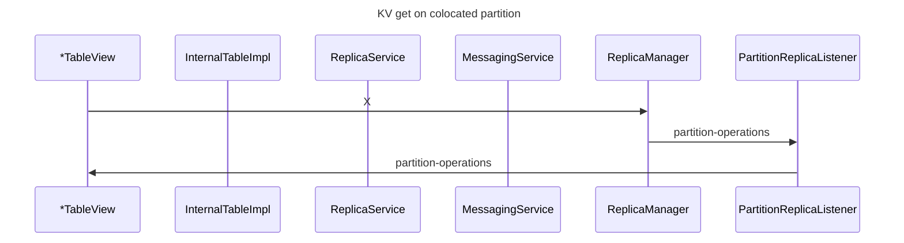

```mermaid
sequenceDiagram
title KV get on colocated partition
participant View as *TableView
participant InternalTableImpl
participant ReplicaService
participant MessagingService
participant ReplicaManager
participant PRL as PartitionReplicaListener
View ->> ReplicaManager: X
ReplicaManager ->> PRL: partition-operations
PRL ->> View: partition-operations
```
