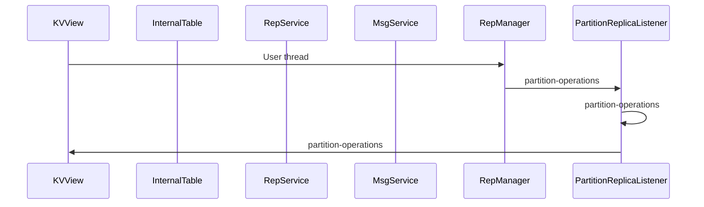
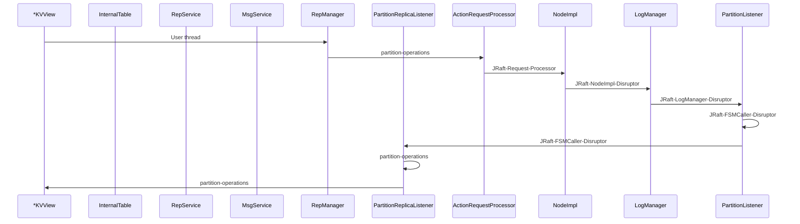
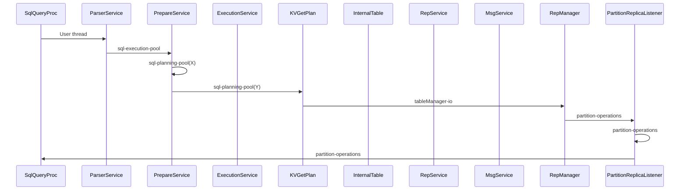
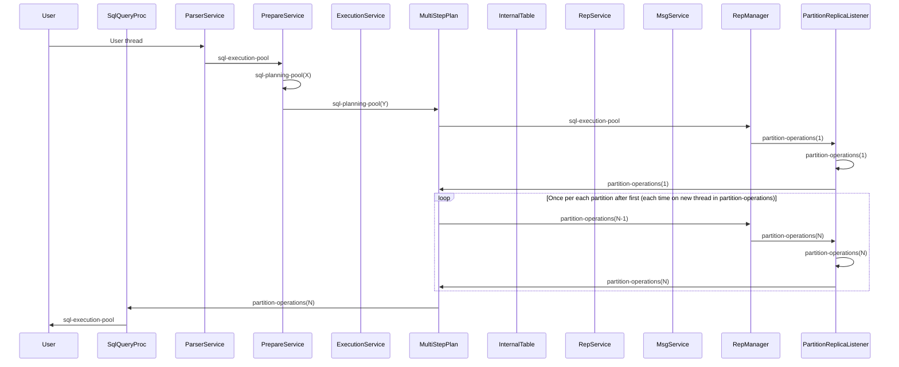

# Hitchhikers guide to the Ignite 3 threads

Which threads are passed by a 'request' made by a user.

This does not include background threads that are not included in the chain of threads servicing a user's request.

This is an attempt to use Sequence Diagrams where our components act as participants, and the messages they exchange are names of thread pools in which execution happens between (or inside) the components. The boundaries might not be exact, the main focus is to demonstrate thread switching.

If a pool has something in parentheses (like `partition-operations(N)`), this is to highlight that a switch happens to the same pool, but (most likely) to another thread of it.

Traces collected on Ignite 3 corresponding to commit https://github.com/apache/ignite-3/commit/bc0d6e919830b366ceb2cfa28d437d6d2bb95197

## Normal cases

Normal (or simple) cases are collected here. That is, no cases like 'a `metastorage-watch` thread is highjacked due to a Schema Sync/Primary await/Transactional locks wait/etc).

### Embedded mode

#### KV get (embedded mode) on partition colocated with current node

#### KV put (embedded mode) on partition colocated with current node

#### SQL get by PK (embedded mode) on partition colocated with current node

#### SQL table scan (embedded mode) on partitions colocated with current node

## Known anomalies

 1. In `*TableView`, after a Schema Sync execution may be switched to `metastorage-watch`
 2. Same thing in `SqlQueryProcessor`
 3. In `InternalTableImpl`, after waiting for a primary replica, execution may be switched to `metastorage-watch`
 4. In `PartitionReplicaListener`, after obtaining a transactional lock, execution might be switched to another thread of `partition-operations` (which is probably ok) or to the common FJP (which is not fine)

## Cases to cover

 * DMLs
 * DDLs?
 * Network communication
 * Non-embedded cases
