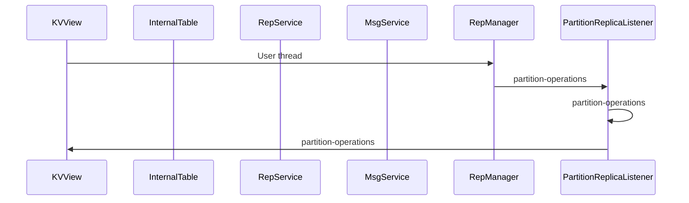
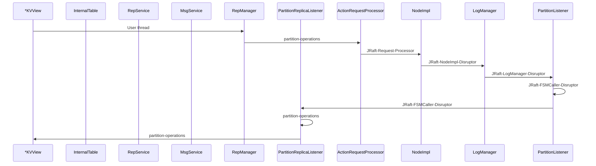

# Normal cases

## Embedded mode

### KV get (embedded mode) on partition colocated with current node

```mermaid
sequenceDiagram
participant View as KVView
participant InternalTable
participant RepService
participant MsgService
participant RepManager
participant PRL as PartitionReplicaListener

View ->> RepManager: User thread
RepManager ->> PRL: partition-operations
PRL ->> PRL: partition-operations
PRL ->> View: partition-operations
```

### KV put (embedded mode) on partition colocated with current node

```mermaid
sequenceDiagram
participant View as *KVView
participant InternalTable
participant RepService
participant MsgService
participant RepManager
participant PRL as PartitionReplicaListener

View ->> RepManager: User thread
RepManager ->> ActionRequestProcessor: partition-operations
ActionRequestProcessor ->> NodeImpl: JRaft-Request-Processor
NodeImpl ->> LogManager: JRaft-NodeImpl-Disruptor
LogManager ->> PartitionListener: JRaft-LogManager-Disruptor
PartitionListener ->> PartitionListener: JRaft-FSMCaller-Disruptor
PartitionListener ->> PRL: JRaft-FSMCaller-Disruptor
PRL ->> PRL: partition-operations
PRL ->> View: partition-operations
```
